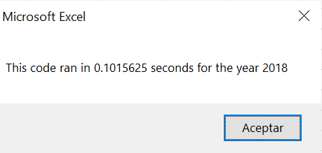

# Stock-Analysis
UCB-Challenge 2

## Overview of project
The porpuse of the project is to help Steve to analyze an entire dataset by refactoring a Excel VBA code and improve the time that the code takes to run collecting certain stock data from the years of 2017 and 2018 to identify if it's a good choice to invest on these stocks.

## Results

### Code

 '1a) Create a ticker Index
    tickerIndex = 0

    '1b) Create three output arrays
    Dim tickerVolumes(12) As Long
    Dim tickerStartingPrices(12) As Single
    Dim tickerEndingPrices(12) As Single
    
    ''2a) Create a for loop to initialize the tickerVolumes to zero.
    For i = 0 To 11
    tickerVolumes(i) = 0

    Next i
        
    ''2b) Loop over all the rows in the spreadsheet.
    For i = 2 To RowCount

        '3a) Increase volume for current ticker
        
        tickerVolumes(tickerIndex) = tickerVolumes(tickerIndex) + Cells(i, 8).Value
     
        
        '3b) Check if the current row is the first row with the selected tickerIndex.
        'If  Then
        If Cells(i, 1).Value = tickers(tickerIndex) And Cells(i - 1, 1).Value <> tickers(tickerIndex) Then
            tickerStartingPrices(tickerIndex) = Cells(i, 6).Value
        End If
        
            
     
        
        '3c) check if the current row is the last row with the selected ticker
         'If the next row’s ticker doesn’t match, increase the tickerIndex.
If Cells(i, 1).Value = tickers(tickerIndex) And Cells(i + 1, 1).Value <> tickers(tickerIndex) Then
tickerEndingPrices(tickerIndex) = Cells(i, 6).Value
         
 End If
          

            '3d Increase the tickerIndex.
If Cells(i, 1).Value = tickers(tickerIndex) And Cells(i + 1, 1).Value <> tickers(tickerIndex) Then
tickerIndex = tickerIndex + 1
            
            
End If

Next i
    
    '4) Loop through your arrays to output the Ticker, Total Daily Volume, and Return.
For i = 0 To 11
        
    Worksheets("All Stocks Analysis").Activate
    Cells(4 + i, 1).Value = tickers(i)
    Cells(4 + i, 2).Value = tickerVolumes(i)
     Cells(4 + i, 3).Value = tickerStartingPrices(i) / tickerEndingPrices(i) - 1
     Cells(4 + i, 3).Value = tickerEndingPrices(i) / tickerStartingPrices(i) - 1
     

### Rsults 2017

### Results 2018

## Summary

### Advantages and disadvantages of refactoring code in general

Refactoring is very useful to create a code that is cleaner and easier to read for others. A few advantages could be: Faster programming and better design.
A few disadvantages are: time consuming and that it may also guide throught a situation that you don't know what to do.

### Advantages and disadvantages of the original and refactored VBA script 

The greatest advantage for me is that the outcome of refactoring was a decrease on macro run time. The original analysis took 0.62 seconds and the new analysis took 0.1 second to run
