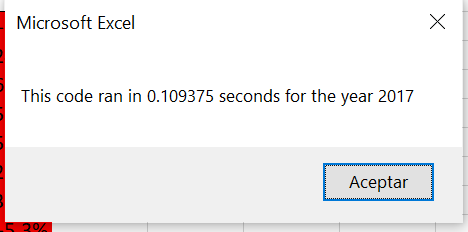

# Stock-Analysis
UCB-Challenge 2

## Overview of project
The porpuse of the project is to help Steve to analyze an entire dataset by refactoring a Excel VBA code and improve the time that the code takes to run collecting certain stock data from the years of 2017 and 2018 to indentidy if it's a good choice to invest on these stocks.

## Results

## Summary

### Advantages and disadvantages of refactoring code in general

Refactoring is very useful to create a code that is cleaner and easier to read for others. A few advantages could be: Faster programming and better design.
A few disadvantages are: time consuming and that it may also guide throught a situation that you don't know what to do.

### Advantages and disadvantages of the original and refactored VBA script 

The greatest advantage for me is that the outcome of refactoring was a decrease on macro run time. The original analysis took 0.62 seconds and the new analysis took 0.1 second to run
